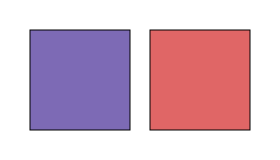
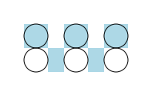
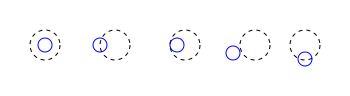
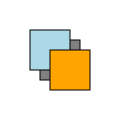
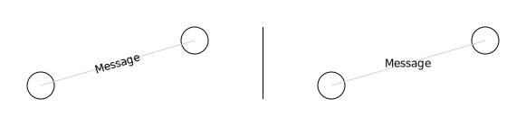
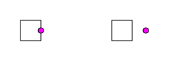
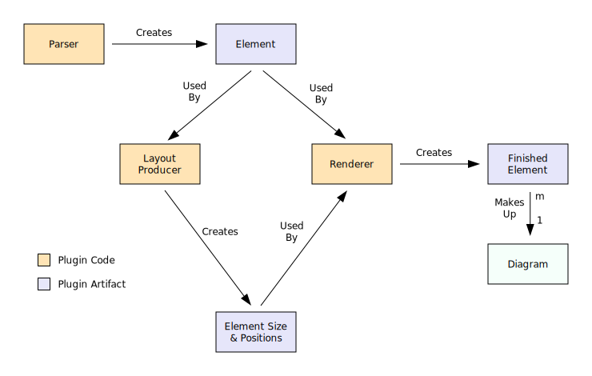

# Git Diagram

Create diagrams you can git

[](https://travis-ci.com/sponbergbadger/git-diagram)
[](https://coveralls.io/github/sponbergbadger/git-diagram?branch=master)

## Installing

With [npm](https://nodejs.org/en/)
```
npm install git-diagram --save
```

## Purpose

The purpose of this library is to provide a concise way to describe a diagram in plain text.

The advantages of having diagrams in plain text are:

- Collaboration
    - With plain text, peer reviews are meaningful
    - Diffs between versions can be read and understood as simply as it can be done for traditional source code
- Version control efficiency
    - Binary files are typically stored in their totality in repositories, as is the case with git. For example, even if there are small differences between 10 versions, the repository will still store 10 different copies of the file.
    - Only actual deltas are stored between text files
- Size
    - Diagrams can be described in less than 1K
    - The size of a git-diagram comes out to < 1% of the equivalent size for a png diagram as big as a laptop screen, and about a third the size of an svg
    - Diagrams kept in a code repository do not increase download times, whereas a repo full of PNGs will have a noticeable effect on the time it takes to clone
- Scale
    - Diagrams can *infinitely* scale without losing resolution

The main disadvantage of this approach compared to a GUI, is of course, you don't immediately see what you get (it's not WYSWYG).

To address that disadvantage, the strategy is two fold:

  - Separate the file into sections, such that each section has a separate area of concern
  - Make the layout (or positioning) section as intuitive as possible

### Intuitive Layout

A reader or reviewer of a git-diagram file can get a general sense of how the diagram will be layed out at a glance. The format provides an intuitive way to understand how elements spatially relate to each other.

The author is alleviated from the need of having to do the math to figure out the specific coordinates of where elements should be placed, rotations, translations, and other transform matrices.

## File Format

The git-diagram format separates the following characteristics into different sections:

- Elements
    - Shape and Size
- Styling
    - How elements look
- Layout
    - X and Y coordinates positioning in two-dimensional space
    - Z indexes for layering
- Shapes
    - Re-usable shapes that can be used in the diagram's layout

There are also some special sections, such as the ability to set the rendered image's margins, and also declare some variables. They are described in [Special Sections](#special-sections)

The git-diagram file must contain Sections in the following order:

1. Elements, Styling, and Special Sections
2. Layout Section
3. Shapes Section*

*\*=optional*

### Elements

There are several built-in elements such as circles and rectangles. There is more detailed info about these elements in [Built-In Types](#built-in-types)

The elements subsection of the git-diagram file follows the format of:

```
$elementType:
  $key: $parameters for this type of element

$anotherElementType:
   $key: $parameters for this type of element
  $key2: $parameters for this type of element
```

The following is an example that has

  - one circle with a radius of 15
  - two lines
      - one with a width of 1 and height of 200
      - one with a width of 100 and height of 1

```
circle:
  o: 15

line:
   l:   1 200
  l2: 100 1
```

The circle's key is ```o```, the tall line's key is ```l```, and the wide line's key is ```l2```.

Each key can be referenced in the layout section.

### Layout

In the layout section, elements are referenced by their keys as they were defined in Section 1.

The positioning of the keys matters. It is essentially a grid, with rows and columns.

The elements on one line are rendered into the same row. Elements on the following line are positioned below the elements from the previous line.

The horizontal position of elements defines the column the element is rendered into. This concept is similar to how markdown tables are declared.

There is also meaning applied to spacing.

- The number of empty newlines between rows determines how far apart the elements relate vertically.
- The number of spaces between columns determines how far apart the elements relate horizontally.
- Sensible defaults are used for the pixel size of the spacing, but can be customized in the special section.

The following is an example that has four circles, equally spaced from each other.

```
circle:
  o: 15

layout:

  o o

  o o

```

> 

*Note: example images do not appear on the npmjs site. Head over to the repo's [page](https://github.com/sponbergbadger/git-diagram#readme) to see them.*

#### Column Span

Col spans can be indicated with dashes.

Example:

```
circle:
  o: 15
  d:  1

rect:
  r: 60 30

line:
  l: 100 1

layout:

  o l--- r
    d  d

```

> 

#### Row Span

Row spans can be indicated with pipes.

Example:

```
circle:
  o: 15

line:
  tall_line: 1 150
          l: 1 50

text:
  one:   Circle
         One
  two:   Circle
         Two
  three: Three

polygon:
  ^: 5,5  10,20  0,20

layout:

                tall_line
  o         o   |
  ^         ^   |
  l         l   |
  one       two |
                three

```

> 

#### Horizontal Touching and Column Determination

The layout parsing logic determines columns where there is an entire column of spaces. If a non-space occupies a column that touches an existing column, that means its part of that column.

In the following example, there are three columns.

  - a, ab, abc, and d belong to column 1
  - column 2 is empty space
  - e belongs to column 3

```
  a
  ab
   abc
      d
        e
```

The widths of the columns are:

  - the first column will be the max width of (a, ab, abc, or d)
  - the second column will be about 20 pixels of empty space
  - the third column will be the width of e

Sometimes we want to start a new column without an empty space. Within the layout section, the ```.``` character has special significance. It means, this delineates columns, but it takes no space.

Example:

```
line:
  calls: 200 1

rect:
  A:  50 100
  B: 100 50

polygon:
  >:   15,5  0,0  0,10

layout:

  A calls-----.> B

```

> 

#### Diagram Size

The diagram size is computed by calculating how far each layer extends into x,y coordinate space, considering transformations (translations, rotations, scaling), plus the margins.

For more detailed information on how the layout works, see [Layout Computation Logic](#layout-computation-logic)

### Styling

Styling of the elements has its own subsection. While it could be done where the elements shape and size are declared, the styling is intentionally in a separate section. The rationale is separation of concerns. From the layout section, you get a relative sense of how the elements are layed out. From the element section, you get the type of shape and its size. That information, especially concisely declared, is enough to form a wire-frame picture in your mind. Finally, the styling section, applies how the elements will look and feel. Eg. colors, dashed lines, fills, corner radiuses, etc.

The elements subsection of the git-diagram file follows the format of:

```
style:
   $key: css styling for element with key
  $key2: css styling for element with key2
```

Example:

```
circle:
  o: 15

style:
  o: stroke: orange

layout:

  o

```

> 

Often several elements of a diagram will have the same styling. To save the author from having to repeat themself (again, one of the goals is brevity), a row that contains the ```'``` character will apply the styling from the row above. Anything following the ```'``` will be applied to element in addition to the styling that was carried forward. If there are several rows that contain a ```'```, the styling carried forward will only be the original styling that was carried forward.

Example:

```
circle:
   o: 15
  o2: 15
  o3: 15
  o4: 15

style:
   o: fill: moccasin; stroke: moccasin
  o2: '
  o3: ' stroke: blue
  o4: ' stroke: green

layout:

  o  o2  o3  o4

```

> 

### Special Sections

#### Default Styles

Default styles apply css styling to svg element types.

The following are built-in defaults:

```
default-style:
  text: 12px sans-serif
  rect: fill: none
  ellipse: fill: none
```

Any of the above values can be overwritten, and any css styling can be applied.

In the following example, textBox has a corner radius, and line is dashed:

```
style:
  textBox: rx: 5px; ry: 5px
     line: stroke-dasharray: 4
```

#### Grid Alignment

By default, elements are aligned in the middle of their grid rectangle.

The [Settings](#settings) Section can change the default for the entire grid.

Specific elements can override the default settings. The format is ```$elementKey: $vertical-align $horizontal-align``` where:

  - ```$vertical-align``` can be set to top, middle, or bottom
  - ```$horizontal-align``` can be set to left, center, or right

As in [Styling](#styling), a ```'``` will carry forward the definition from the above line.

Example:

```
grid-align:
   o: middle center
  o2: '
```

#### Fonts

Custom font-families can be included in diagrams. A font can come from a local file (otf, ttf) or from a url. There is nice collection of [Google Fonts](https://fonts.google.com/) available online.

Fonts from a local file are specified by the relative path to the font. The key is the family name.

Fonts from a url are listed under the special ```import``` key, because the font files over a url define the font family names. One url per line can be specified.

Example:

```
text:
   message: Hello
  message2: World
  message3: Ipsum

style:
  message2: font-family: Roboto
  message3: font-family: Indie Flower

default-style:
     text: font-family: Lobster

font:
        import: https://fonts.googleapis.com/css?family=Roboto
                https://fonts.googleapis.com/css?family=Lobster
  Indie Flower: fonts/IndieFlower-Regular.ttf

layout:

  message
  message2
  message3

```

> 

#### Margin

The default image margin is 30 pixels on all sides.

They can be overridden with left, top, right, and bottom.

Example:

```
margin:
    left: 10
     top: 20
   right: 15
  bottom:  5
```

#### Settings

There are built in settings that be overidden.

For empty columns, the default width is 20 pixels

For empty rows, the default height is 20 pixels

The default width of a text element is 5 pixels

The default height of a text element is 30 pixels

The default vertical grid alignment is middle. It can be set to: top, middle, bottom

The default horizontal grid alignment is center. It can be set to: left, center, right

Example:
```
settings:
   horizontal-spacer: 20
     vertical-spacer: 20
          text-width:  5
         text-height: 30
          grid-align: center
         grid-valign: middle
```

#### SVG

In the event that a diagram author needs a feature that is not provided by git-diagram, raw svg can be provided, which will be appended to an element's block during rendering.

Using this special type should be a last resort.

Example:

```
svg:
  elementKey: transform="translate(25, 0)"
```

#### Variables

Variables can be declared in this subsection and then used within the rest of Section 1 for values (not keys). They can be used by prefixing the variable name with a ```$``` character.

Example:

```
rect:
  a: 100 100
  b: 100 100

style:
  a: fill: $my-purple
  b: fill: $my-pink

variable:
  my-purple: rgb(125, 106, 181)
    my-pink: rgb(224, 102, 102)

layout:

  a b

```

> 

#### Debug

While writing diagrams, it can sometimes be helpful to see the grid that has been determined for the default layer. There is a debug option that will render your diagram with a checkered grid in the background. To enable that feature, set ```showGrid``` to true.

Example:

```
circle:
   o: 15

debug:
  showGrid: true

layout:

  o o o
  o o o

```

> 

### Dynamic Width And Height

Much of the time, elements will be specified using fixed widths and heights. There are some cases where the author will want an element to consume all available horizontal space within its row or all available vertical space within its column. The available space is computed as the max size of the space minus the space taken by fixed element sizes.

To declare that an element's dimension should fill available space, the keyword ```fill``` can be used. The element parameters that support fill are listed in [Built-In Types](#built-in-types)

When using fill, an optional offset can be specified in parenthesis. For example, to fill all available space minus 20 pixels, that is specified with ```fill(-20)```.

By default, when an element attempts to fill all available space, the available space is limited to the size of the layer that contains the element. By default, a layer's size is only as big as it takes to lay out fixed size elements. A layer, however, can have its size specified. In that case, there may be additional space available for an element to fill. More on that in [Layers](#layers).

Example:

```
circle:
  o: 15

line:
   l: fill 1
  l2:  200 1

layout:

   o           o

  l2------------

     l--------

```

> 

### Layers

Layers can be added to the diagram in Section 2, the Layout section. They are denoted by the ```*``` character at the beginning of a line.

A layer can be positioned in one of two ways.

  1. [Layer Positioning Relative To Another Element](#layer-positioning-relative-to-another-element)
  2. [Layer Positioning On A Path](#layer-positioning-on-a-path)

#### Layer Positioning Relative To Another Element

To position an element relative to another element, the keyword ```at``` is used followed by the anchor element's key.

Example:

```
path:
  cloud: 70 50
         m 10,9
         a 20,20 1 0,0 0,40
         h 50
         a 20,20 1 0,0 0,-40
         a 10,10 1 0,0 -15,-10
         a 15,15 1 0,0 -35,10
         z

text:
  label: Account
         Service

style:
  cloud: fill: white; stroke: black

layout:

  cloud

* at cloud

  label

```

> 

##### Layer Positioning Control Using Relative To Another Element

The positioning can be further controlled. The full syntax of the layer position is by expressed the following, where the parts within brackets are optional, and words prefixed with $ are variables.

```
* at [$anchorPoint of] $elementKey [with my $anchorPoint] [plus $x,$y]
```

The first anchor point refers to the reference element. The second anchor point refers to the anchor on the new layer that is positioned over the first anchor point.

Plus x,y is an offset from the position.

anchorPoint provides for 9 anchor points on the reference element. The horizontal anchor can be specified by left, center, or right. The vertical anchor can be specified by top, middle, bottom.

If there are more than one element with the same key, the reference element can be indexed with brackets. The index is 1-based.

Example:

```
circle:
  ref: 15
    o:  7

style:
  ref: stroke-dasharray: 4
    o: stroke: blue

layout:

  ref  ref  ref  ref ref

* at ref

  o

* at left of ref[2]

  o

* at left of ref[3] with my left

  o

* at bottom-left of ref[4] with my bottom-right

  o

* at ref[5] with my top plus 0,7

  o

```

> 

#### Layer Positioning On A Path

To position an element on a path between two elements, the keywords ```from``` and ```to``` are used followed by the anchor elements' keys, respectively.

Example:

```
circle:
  o: 15

line:
  line: fill 1

layout:

  o
        o

* from o to o[2]

  line

```

> 

##### Layer Positioning Control Using On A Path

The positioning can be further controlled. The full syntax of the layer position is expressed by the following, where the parts within brackets are optional, and words prefixed with $ are variables.

```
* from [$anchorPoint of] $elementKey to [$anchorPoint of] $elementKey
[on $pathPoint point] [with my $anchorPoint] [plus x,y]
```

The first anchor point refers to the *from* reference element. The second anchor point refers to the *to* reference element.

The same rules from [Layer Positioning Control Using Relative To Another Element](#layer-positioning-control-using-relative-to-another-element) apply for x,y offset, anchorPoint description, and reference indexing.

The pathPoint can be expressed as one of three locations on the path: start, center, or end.

The actual anchor point is calculated somewhere along the path plus the optional offset.

The third anchor point refers to the anchor on the new layer that is positioned over the actual anchor point.

#### Referencing Elements in Other Layers

Layer positioning references specify elements in the default layer. Elements in other layers can be referenced by prefixing the element's key with ```l:$index``` where index is the z-index of the layer being referenced. You can only reference into layers that have an assigned z-index. Setting a layer's z-index is discussed in the following section.

Example:

```
circle:
  o: 15

line:
  line: fill 1

layout:

  o
         o
    o

*:2 from o to o[2]

  line

* from l:2:line to o[3]

  line

```

> 

#### Z-Index and Rendering Order

Layers are layed out and rendered in the order they appear in the git-diagram file. The original layer, or the default layer, has a z-index of 1 by default. Each additional layer, by default, has an incremented z-index.

The z-index for a layer can be specified by appending ```:$z-index``` to the ```*``` character when denoting a layer.

Layers without a z-index will take availabes indexes in order starting from 1, and skipping indexes where they have been manually specified. For example, if a diagram has two layers, and the second layer specifies a z-index of 1, then the default layer will have a z-index of 2. Normally the default layer's z-index is 1.

Example:

```
rect:
  r1: 40 40
  r2: 40 40
  r3: 40 40

style:
  r1: fill: lightblue
  r2: fill: gray
  r3: fill: orange

layout:

  r1

*:1 at r1 plus 10,10

  r2

* at r1 plus 20,20

  r3

```

> 

#### Rotating Layers

Layers can be rotated to a specified angle by appending ```rotateTo:$angle``` after the layer positioning syntax.

In the following example, without specifying rotateTo, the angle of the text matches the angle of the light gray line.

Example:

```
circle:
  o: 15

line:
  line: fill 1
     l:    1 fill

style:
  line: stroke: lightgray

text:
  message: Message

layout:
          o   l           o
              |
  o           |   o

* from o[3] to o

  line

* from o[3] to o

  message

* from o[4] to o[2]

  line

* from o[4] to o[2] rotateTo:0

  message

```

> 

#### Layer Size

A layer's width and height are set exactly to the layer's computed size using the layer's fixed size elements. When a layer contains an element that uses fill, the available space is the space remaining in the layer's width or height that has not already been taken.

The available space can be increased to match another layer's size or the distance of path. When using the distance of a path, it only applies to the width element, since layers are layed out from left to right when following a path.

The fill dimension can be specified by appending ```fillWidth:$option``` or ```fillHeight:$option``` after the layer positioning syntax.

The options for fillWidth are: ```$width```, ```$l:Z:width```, ```$path```, ```$colspan```, or a fixed value in pixels.

  - $width matches the width of the default layer
  - $l:Z:width matches the width of a layer by z-index, replace Z with an integer
  - $path matches the distance of the path
  - $colspan matches the distance available that has not already been taken in that layer's column span in the grid.
  - A fixed values in pixels is a float

The default fillWidth is:

  - When on a path: $path
  - When not on a path: $colspan

The options for fillHeight are: ```$height```,  ```$l:Z:$height```,  ```$rowspan```, or a fixed value in pixels.

  - $height matches the height of the default layer
  - $l:Z:height matches the height of a layer by z-index, replace Z with an integer
  - $rowspan matches the distance available that has not already been taken in that layer's row span in the grid.
  - A fixed value in pixels is a float

The default fillHeight is $rowspan

Example:

```
line:
  line: fill(-40) 1

rect:
  A:  50 100
  B: 100 50

polygon:
  >:   15,5  0,0  0,10

layout:

  A
               B

* from right of A to left of B fillWidth:$path

  line->

```

> 

### Re-Usable Shapes

Re-usable shapes can be declared in Section 3. Shapes refer to the elements in Section 1, and are layed out in the same fashion as the diagram is layed out in Section 2. Each shape declares a name, which can then be referenced in Section 1 by other layers.

Shapes are defined in Section 3 (after the diagram's layout and layers).

A shape can be defined by ```shape:$shapeName``` and then used in Section 1 as a ```shape``` element.

Example:

```
circle:
  o: 15

shape:
  s: threeCircles

layout:

  s    s

shape:threeCircles

  o   o
    o

```

> 

#### Shape Parameters

Shapes can take parameters to make the re-usable shape more dynamic.

The following example creates a re-usable text box and also demonstrates scaling one of the shapes.

Example:

```
rect:
  textBoxRect: 100 50

text:
  one: One
  two: Two

shape:
  textBox1: textBox(one)
  textBox2: textBox(two) 70 35

layout:

  textBox1   textBox2

shape:textBox (text)

  textBoxRect

* at textBoxRect

  $text

```

> 

Shape parameters also work in layer description offsets.

Example:

```
rect:
  rect: 30 30

circle:
  dot: 4

shape:
  s1: dotAndBox(0)
  s2: dotAndBox(20)

style:
  dot: fill: magenta

layout:

  s1     s2

shape:dotAndBox (dx)

  rect

* at right of rect plus $dx,0

  dot

```

> 

#### Shape Dynamic Width And Height

Shapes can also use fill for the width and height. Where fill is used for the height, width must be specified. Both the width and height can use fill simultaneously.

#### More Verbose Shapes

There are two ways a shape can be described: Concise, and Verbose.

The examples above use the Concise method, which is that the lines for the shape's layout immediately follow the ```shape:$name``` declaration.

The Verbose method works like the diagram, where both Section 1 and Section 2 are specified.

The shape works within the same scope as the diagram. For example, a variable declared in the diagram's Section 1 can be referenced in the shape's Section 1.

All element types are available.

All special sections are available with the following exceptions:

  - Settings scoped to only the shape
      - spacers
  - Variable declarations are ignored

Example:

```
circle:
  o: 15

shape:
  circles: tightCircles

layout:

  o o

* at bottom-left of o with my top-left plus 0,20

  circles

shape:tightCircles

settings:
  horizontal-spacer: 5

layout:

  o o

```

> 

## Built-In Types

The following are the element types that can be used out of the box. Custom element types can be included as [Plugins](#plugins)

Parameters that are fillable as described in [Dynamic Width And Height](#dynamic-width-and-height) are denoted in the table.

| Name    | Parameters                 | Fillable Params | Notes                                                                                         |
|---------|----------------------------|-----------------|-----------------------------------------------------------------------------------------------|
| circle  | radius                     |                 |                                                                                               |
| ellipse | radius-width radius-height | radius-width radius-height |                                                                                    |
| line    | width height               | width height    |                                                                                               |
| rect    | width height               | width height    |                                                                                               |
| polygon | array-of-coordinates       |                 | width and height are determined from the coordinates, csv separated                           |
| text    | width\* height\* text      |                 | when width is provided, height must be provided. \*=optional                                  |
| path    | width height attributes    | width height    | attributes as defined in [svg](https://developer.mozilla.org/en-US/docs/Web/SVG/Element/path) |
| image   | width height url           | width height    | url is the relative path to a local file or a url to a remote image                          |
| shape   | name(params) width\* height\*| width height  | name of a shape that is defined in the file. The parenthesis with params are optional. \*=optional                                      |

### Text Alignment

Text is aligned by default with the element's center positioned over its grid point center.

Horizontal alignment and vertical alignment can be controlled. This is a special case when handling text, since two things must be done in coordination.

  1. Adjust the x,y coordinate position
  2. Set the css property

Svg uses the css style ```text-anchor``` to control horizontal alignment with a value of start, middle, or end, for left, center, and right aligned respectively.

Svg uses the css style ```dominant-baseline``` to control the vertical alignment with a value of hanging, middle, or alphabetic, for top, middle, and bottom aligned respectively.

When the author uses [Grid Alignment](#grid-alignment), git-diagram will do both of those things. Css will be prefixed to the element's style class definition. Therefore, it is not necessary for the author to use the above properties in the style section. (If the author does also declare those css properties, they will override the settings that git-diagram has determined).

## Plugins

A user of this library can supply Plugins to provide their own element types, which can then be used alongside the built-in types.

For example, let's say a diagram author wants to use a re-usable text box shape across all of their diagrams. Rather than having to include the shape in every git-diagram file, they can write a plugin in one file, and have the element available to all of their diagram files.

Continuing the example, suppose this is what the author wants their diagram file to be:

```
circle:
  o: 15

textbox:
  box: 80 25 Hello, World!

layout:

  o   o   o   o

     box

```

> 

The author could create a plugin that parses the ```textbox``` box.

### Creating A Plugin

Creating a plugin requires writing code to describe the plugin and invoking an API accepted by this library.

The architecture makes a distinction between three separate steps when producing a diagram.

1. Parsing
    - Reading the git-diagram text file and parsing it into elements
2. Producing the layout
    - Computing coordinates and sizes for elements and layers
    - Creating transform operations, including scaling, translating, and rotating
3. Rendering
    - Generating svg for the elements using the above computed positions and sizes

For each step, a Plugin can supply code for:

  - Parsers
  - Layout Producers, and
  - Renderers

#### System Design

  - A Parser can create one Element at a time
      - A Parser will be ran for every element in a shape's layout. Therefore, many Elements will be created after the Parsing step.
      - An Element type can be created by multiple types of Parsers
  - The Layout Producer consumes all the Elements and produces their Size & Positions.
  - The Renderer consumes all the Elements and their Size & Positions to create a Finished Element.
  - The Finished Elements make up the Diagram.



#### Plugin API

Plugin code runs in a special context that has the following API available:

```javascript
function registerParser(userFacingType, parserFunction) {}

function registerLayoutProducer(type, layoutProducerFunction) {}

function registerRenderer(type, rendererFunction) {}

function parseKeyContent(line, rem, numTokens, variables, extractParams = false) {}

function fillOrFloat(word, fillSupported = false) {}

function round(float) {}
```

where the variables:

  - ```userFacingType``` is the key in the git-diagram file that invokes the parser function
  - ```parserFunction``` is the name of the plugin function for parsing the lines of text from the git-diagram file for an element's description
  - ```type``` is the internal key for the type of element to render. This key is matched with a Layout Producer and a Renderer.
  - ```layoutProducerFunction``` is the name of the plugin function for laying out the element, which determines its size, position, and transforms
  - ```rendererFunction``` is the name of the plugin function for rendering the element to svg

where the function:

  - ```parseKeyContent``` is a helper function to parse out information from the line. When a map of variables are passed in, they are replaced within the text. It returns an object with the following properties:
    - key
        - the key
    - params
        - while extractParams are true and when the line contains parenthesis, these are parameters extracted from between them. They are split by either space or comma. The value type is an array.
    - tokens
        - when the function is invoked with numTokens > 0, it parses the first n number of tokens out the content and returns them as an array
    - content
        - the remainder of the content with newlines removed
    - contentLines
        - all of the content's lines, as an array, with each line as an entry
  - ```fillOrFloat``` is a helper function that:
      - when the word is 'fill', if fill is not supported, throws an error
      - when the word is 'fill' and fill is supported, returns 'fill'
      - when the word is not 'fill', parses the word to a float
          - if the resulting value is not a number, throws an error
  - ```round``` is a helper function that:
      - rounds the float to three decimal places
      - preferably used when rendering the svg file, as three digits is accurate enough, and reduces the svg file size

##### Parser Function Contract

###### Input

The parser function is passed the following parameters, in order:

  - ```line```
      - String: The first line of text that describes the element
  - ```remaining```
      - Array: The remaining lines of text in the git-diagram file section
      - Be responsible when parsing this. If you remove all the lines from this array, then you must handle them.
  - ```variables```
      - Map: A map of variable name to value. This is the list of variables declared in the git-diagram special section.
  - ```settings```
      - Map: A map of settings. This is the list of settings that have defaults and can be overridden in the git-diagram special section.

###### Output

The parser function must return an object that contains the following properties:

  - ```key```
      - String: the key for the element
  - ```type```
      - String: the internal key for the type of element to render. This key is matched with Layout Producer and Renderer.
  - ```width```
      - Float or String: either a floating point value for the element's width, or the string ```fill```
  - ```height```
      - Float or String: either a floating point value for the element's height, or the string ```fill```

In addition to those properties, any number of custom properties can be added to pass information to the layout producer and renderer. For example, the polygon parser adds the field *points*, which is an array of the polygon's points.

Example:

```javascript
const C = require('./Const')

registerParser(C.circle, parserCircle)

function parserCircle(line, rem, variables) {
  const {key, tokens} = parseKeyContent(line, rem, 1, variables)

  const radius = fillOrFloat(tokens[0])

  return {
    key: key,
    type: C.ellipse,
    width: radius * 2,
    height: radius * 2,
  }
}
```

##### Layout Producer Function Contract

###### Input

The layout producer function is passed the following parameters, in order:

  - ```object```
      - The object that was returned by the parser
  - ```position```
      - An object that describes where this object has been placed in the layout grid, with the following fields:
          - ```x```
              - The x coordinate
          - ```y```
              - The y coordinate
          - ```colWidth```
              - The width of the column
          - ```rowHeight```
              - The height of the row

###### Output

The parser function must return an object that contains the following properties:

  - ```cx```
      - Float: the x coordinate of the center of this element
  - ```cy```
      - Float: the y coordinate of the center of this element
  - ```width```
      - Float or String: either the element's width, or the string ```fill```
  - ```height```
      - Float or String: either the element's height, or the string ```fill```

In addition to those properties, any number of custom properties can be added to pass information to the renderer. For example, the path layout producer adds the fields *x1* and *y1*, which are the x and y coordinates of where the path begins.

Example:

```javascript
registerLayoutProducer(C.ellipse, layoutEllipse)

function layoutEllipse(obj, position) {
  const {x, y, colWidth, rowHeight} = position

  let cx = x + colWidth / 2
  let cy = y + rowHeight / 2

  return {
    cx,
    cy,
    width: obj.width,
    height: obj.height,
    rx: obj.width / 2,
    ry: obj.height / 2,
  }
}
```

##### Renderer Function Contract

###### Input

The renderer function is passed the following parameters, in order:

  - ```object```
      - The object that was returned by the parser
  - ```sizeAndPosition```
      - The object that was returned by the layout producer
  - ```styleBlock```
      - String: rendered svg block for the css styling applied to this element, prefixed with a space. If no styling has been applied, its an empty string.
  - ```svgBlock```
      - String: rendered svg block for the raw svg from the special section, prefixed with a space. If no svg has been applied, its an empty string.

###### Output

The renderer function must return a string of the rendered svg for the element.

Example:

```javascript
function renderEllipse(obj, sizeAndPosition, styleBlock, svgBlock) {
  let {cx, cy, rx, ry} = sizeAndPosition

  return `<ellipse cx="${cx}" cy="${cy}" rx="${rx}" ry="${ry}"
           stroke="black"${styleBlock}${svgBlock}></ellipse>`
}
```

## Layout Computation Logic

- Layers are parsed in the order they are defined in the git-diagram file.
- Layers can only reference layers that have been defined above them in the git-diagram file.
- The diagram is parsed by making a grid based on the default layer.
    - Each grid rectangle has either empty space or an element.
- Following layers can reference elements in the default layer, or elements in layers defined above it.

When a layer is layed out, the following steps are applied.

1. Column spaces are marked
1. Row spaces are marked
1. The grid is inspected for elements with a fixed width and height, and a grid rectangle is allocated the fixed sizes.
    - If a ```shape``` is encountered that is not ```fill``` for width or height, the shape is layed out immediately. The grid rectangle is allocated the shape's size.
    - If the shape has ```fill``` the layout is deferred until the available space has been determined.
1. Element column spans are determined (indicated by ```-```)
1. Element row spans are determined (indicated by ```|```)
1. Column widths are determined
    - For each element in the grid:
        - The width is either fixed or fill. If it is fill, the width is determined to be the amount of space available\* across the columns the element spans.
        - If any columns are not already allocated a width, the width of the element, minus the space already taken, is spread across the columns.
        - If all the columns already have space allocated, and the width of the element is larger than the space already allocated, the width of the element is divided evenly across the columns.
    - For any column that is empty and hasn't been allocated a width, the column width becomes the size of the horizontal spacer.
1. Any ```shapes``` that have fillable width but not fillable height, are layed out
1. Row heights are determined
    - For each element in the grid:
        - The height is either fixed or fill. If it is fill, the height is determined to be the amount of space available\* across the rows the element spans.
        - If any rows are not already allocated a height, the height of the element, minus the space already taken, is spread across the rows.
        - If all the rows already have space allocated, and the height of the element is larger than the space already allocated, the height of the element is divided evenly across the rows.
    - For any row that is empty and hasn't been allocated a height, the row height becomes the size of the vertical spacer.
1. Any ```shapes``` that have a fillable height are layed out
    - Row heights are allocated to the shape's height

\* The space available is described in [Layer Size](#layer-size)

## Running The Library

To run the library

1. Construct an SvgDiagramFactory
    - Pass in the base path from which relative paths will be resolved
    - Pass in an array of paths for Plugin code
1. Call renderDiagram on the factory with input and output paths

Example:

```javascript
const path = require('path')

const SvgDiagramFactory = require('git-diagram').SvgDiagramFactory

const basePath = 'diagrams'
const pluginPaths = ['diagrams/js/Plugins.js']

const diagramFactory = new SvgDiagramFactory(basePath, pluginPaths)

function renderDiagram(filename) {
  const input = `${filename}.txt`
  const output = path.resolve(basePath, 'output', `${filename}.svg`)
  diagramFactory.renderDiagram(input, output)
}

renderDiagram('diagram1')
renderDiagram('diagram2')
...
```

## Best Practices

The purpose of this library is to provide a concise way to describe a diagram in plain text.

This is a lofty aim and it's important to understand the rationale behind it.

The driving force is collaboration. Several team members can modify diagrams over time. Sometimes a diagram has been created by a person that is no longer on your team, or even at your company. It's important that other team members can pick up the diagram file, understand it, and be able to make meaningful changes.

This library provides a way for the diagram to be concisely described. But that's not enough for a successful collaboration. The author has a lot of control over how 'readable' their diagram file is to their teammates.

Readability is subjective. Therefore, it's encouraged that teams come up with their own conventions.

### Conventions

The following is a recommended set of conventions.

#### Column Aligment

Humans read and understand data more efficiently in tabular form.

- Indent everything with 2 spaces. This applies to:
    - Element type declarations
    - Layouts
    - Special sections
- Right align keys
- Right align numbers
- Left align text
- Where some text elements specify width and height, move the text to the right.
- When two columns of text meet, consider alternating right-and-left alignment.

Example:

In the line elements section, the element with the longest key is indented by two spaces. The remaining keys are right aligned. The next column contains elements' widths, right aligned. The next column contains elements' heights, also right aligned.

The image section is similar, with the addition of the relative path to images, left aligned.

The shape section demonstrates that where two columns of text meet, in the shape parameters, column one is right aligned, and column two is left aligned.

The text section demonstrates that where one of the elements has specified its width and height, the text for all elements are left aligned.

```
line:
  wide-line: 200   1
          l:   1 160
       line: 200   1

image:
    computer: 105  60 images/macbook.svg
       phone:  30  60 images/iphone.svg
        lego:  40  40 images/lego.svg
  repository: 250 242 images/repository.svg

shape:
                shape1: lego
     longShapeWithText: iconWithText(   computer computerLabel   )
  anotherShapeWithText: iconWithText( repository repositoryLabel )

text:
  multiline: 150 40 Some text that
                    spans two lines
      label:        Label

```

#### Variables

Use meaningful variables as a way to describe meaning.

Example:

By using variables for rgb colors, it's easier to understand how the icons will appear than if the rgb numbers weren't declared through variables.

```
// This declaration is not ideal

font-awesome:
   server: fas server   75 75 rgb(125, 106, 181)
      pdf: fas file-pdf 50 60 rgb(125, 106, 181)
  archive: fas archive  60 60 rgb(191, 144,   0)

// This is better

font-awesome:
   server: fas server   75 75 $purple
      pdf: fas file-pdf 50 60 $pink
  archive: fas archive  60 60 $darkyellow

variable:
          purple: rgb(125, 106, 181)
            pink: rgb(125, 106, 181)
      darkyellow: rgb(191, 144,   0)
```         

#### Characters In The Layout

Consider using characters in the layout that hint at their shape.

Examples:

  - ```>``` for a right-pointing triangle
  - ```^``` for a upwards triangle
  - ```v``` for a downwards triangle
  - series of ```---``` for a horizontal line
  - series of ```|``` for a vertical line and pairs nicely with the letter ```l```
  - ```o``` for a circle
  - ```O``` for a bigger circle

Example:

```
circle:
  o: 15
  O: 30

line:
  line: 1 100

polygon:
  >:  0,0  0,10 15,5  
  v:  0,0 10,0   5,15

layout:

  o line------> o

  O
  l
  |
  |
  v
  O

```
